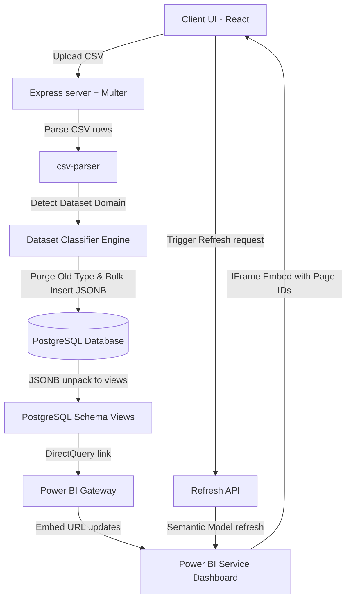

# 📊 InsightFlow BI: Dynamic Full-Stack Analytics Platform

[](https://nodejs.org/)
[](https://react.dev/)
[](https://www.postgresql.org/)
[](https://powerbi.microsoft.com/)
[](https://azure.microsoft.com/)
[](https://tailwindcss.com/)

**InsightFlow BI** is a high-performance, enterprise-grade business intelligence platform that solves the cold-start problem of dashboard creation. By providing an end-to-end data pipeline, it allows business users to dynamically upload unstructured/semi-structured CSV datasets, automatically detects the analytical domain (Finance, Healthcare, or Sales), stores records dynamically using PostgreSQL JSONB schema, and loads dynamic dashboards embedded directly into React using Power BI DirectQuery. 

This architecture guarantees that the moment a dataset is uploaded, the backend updates the PostgreSQL view schemas, triggers semantic refreshes, and the UI immediately renders corresponding visual sheets, trends, and charts without manual developer intervention.

---

## 🛠️ Architecture & System Flow

InsightFlow BI relies on a dynamic data flow where CSV structures map directly to PostgreSQL JSONB documents, which are subsequently unpacked into normalized SQL views and queried on-demand by Power BI via DirectQuery gateway.



### 🧱 System Components Detail

#### 1. Frontend Architecture (React)
- **State Hydration**: Uses React Context API (`DatasetContext`) to store globally detected dataset properties, total row counts, and dynamic column headers.
- **Dynamic Layout Routing**: Detects route transitions and matches routes (`/expense-trends`, `/disease-analysis`, etc.) to specific Power BI report page sub-identifiers (`pageId`) configuration maps.
- **Dynamic Sidebar**: A context-aware sidebar that displays real-time dataset statistics (metadata rows count, type detection status) and renders sidebar links dynamically matching the active dataset's subpages.
- **Fluid Embedding**: Utilizes secure Microsoft Power BI iframe embedding parameterized with workspace tokens and specific target canvas coordinates.

#### 2. Backend Architecture (Node.js & Express)
- **Stream Ingestion Pipeline**: Handles multipart CSV payloads using `multer` storage and pipes readable buffers through `csv-parser` to prevent memory bottlenecks on large datasets.
- **Heuristic Classifier Engine**: Performs keyword-matching heuristics across parsed CSV headers to classify files into `Finance`, `Healthcare`, or `Sales` schemas.
- **Database Connection Pooler**: Interacts with PostgreSQL using active pooling (`pg.Pool`) to perform batch removals and fast database insertions.
- **OAuth 2.0 Integration**: Implements Microsoft Authentication Library (`@azure/msal-node`) to secure semantic model refreshes using Azure Active Directory tenant credentials.

#### 3. Database Layer (PostgreSQL)
- **JSONB Dynamic Storage**: Stores CSV rows inside a flexible schema architecture inside the `uploaded_data` table, reducing schema migrations to zero.
- **Domain-Specific Views**: Exposes dynamic tables to Power BI through customized view queries that unpack JSONB keys and cast them into their respective data types (`NUMERIC`, `DATE`, `VARCHAR`).

#### 4. Power BI Integration
- **DirectQuery Mode**: Resolves query latency by requesting data from PostgreSQL views in real-time, bypassing internal Power BI file storage limits.
- **Gateway Bridge**: Connects localhost/on-premise PostgreSQL to Azure-hosted Power BI Service securely.
- **Embedding Parameterization**: Generates conditional links using dynamic report parameters (`&pageName=PAGE_ID&filterPaneEnabled=false`) dynamically configured on state changes.

---

## ⚡ Core Features

- 📂 **Zero-Configuration CSV Ingestion**: Drag-and-drop CSV files of any shape. The system parses and registers them in milliseconds.
- 🧠 **Dynamic Domain Detection**: Automated structural detection mapping the CSV headers to target segments:
  - 💵 **Finance**: Matches keyword lists (`amount`, `expense`, `transaction`, `payment`, `finance`) to auto-spin up finance panels.
  - 🏥 **Healthcare**: Matches keyword lists (`patient`, `doctor`, `hospital`, `disease`, `treatment`) to trigger medical analytics.
  - 📈 **Sales**: Matches keyword lists (`product`, `sales`, `revenue`, `customer`, `profit`) to load commerce charts.
- 🔄 **Real-time Pipeline Update**: Data instantly synchronizes from database views to embedded reports via Power BI DirectQuery connections.
- 🗺️ **State-Driven Routing**: Changes sidebars and pages dynamically according to the active dataset context.
- 🔐 **Azure MSAL Integration**: Integrates MSAL Public Client flow to retrieve access tokens for scheduled updates and workspace refreshes.

---

## 📂 Project Directory Structure

```filepath
InsightFlow-BI/
├── client/                     # React Single Page Application (Vite/CRA)
│   ├── public/                 # Static assets and icons
│   ├── src/
│   │   ├── componentes/        # Reusable view components
│   │   │   ├── pages/          # Dynamic dashboard route pages
│   │   │   │   ├── dynamicdashboard.jsx  # Main container for Power BI Embeds
│   │   │   │   ├── finance.jsx           # Finance view routes container
│   │   │   │   ├── healthcare.jsx        # Healthcare view routes container
│   │   │   │   └── sales.jsx             # Sales view routes container
│   │   │   ├── Power_bi.jsx    # Secure IFrame dynamic embedding component
│   │   │   ├── sidebar.jsx     # Dynamic sidebar matching dataset context
│   │   │   └── upload.jsx      # CSV Drag-and-Drop drag UI with progress feedback
│   │   ├── config/
│   │   │   └── dashboardPages.jsx  # Page metadata and Power BI Canvas Page IDs mapping
│   │   ├── context/
│   │   │   └── context.js      # Global React Context tracking dataset schema state
│   │   ├── App.css             # Main styling configurations
│   │   ├── App.js              # Application entry routing configuration
│   │   ├── index.css           # Global layout declarations
│   │   └── index.js            # React App bootstrap root
│   ├── package.json            # React Client dependencies & scripts
│   └── tailwind.config.js      # Tailwind styling layouts config
│
├── server/                     # Express.js REST API Server
│   ├── db/
│   │   └── db.js               # PostgreSQL pg client connection pool setup
│   ├── routes/
│   │   ├── controllers/        # Express request routing logic abstraction
│   │   ├── refreshRoutes.js    # Power BI Azure REST semantic refresh controllers
│   │   └── uploadRoutes.js     # Multer setup, CSV parsers, classifier and DB insertion
│   ├── services/
│   │   ├── auth.js             # MSAL configuration client for Azure Token generation
│   │   └── powerbi.js          # REST API integration to refresh datasets remotely
│   ├── uploads/                # Local cache directory for raw uploaded CSV files
│   ├── utils/
│   │   └── dataset.js          # Classification heuristics heuristic algorithm
│   ├── .env                    # System environmental secrets (Credentials/IDs)
│   └── package.json            # Express server dependencies & scripts
│
├── Finance_dashboard.pbix      # Power BI Finance Dashboard Blueprint
├── Sales_dashboard.pbix        # Power BI Sales Dashboard Blueprint
└── healthcare_dashboard.pbix   # Power BI Healthcare Dashboard Blueprint
```

---

## 🛠️ Installation & Setup

Follow these steps to deploy and run InsightFlow BI locally:

### 1. Prerequisites
- **Node.js** (v18.x or above)
- **PostgreSQL** (v14.x or above)
- **Power BI Desktop** (for editing `.pbix` templates)
- **Power BI On-Premises Data Gateway** (required to bridge local PostgreSQL data with the Cloud Power BI Service)

---

### 2. PostgreSQL Setup
Create your target database and dynamic JSON data tables.

```sql
-- Step 1: Create Database
CREATE DATABASE insightflow;

-- Step 2: Connect to the database and create uploaded_data table
\c insightflow;

CREATE TABLE uploaded_data (
    id SERIAL PRIMARY KEY,
    dataset_type VARCHAR(50) NOT NULL,
    data JSONB NOT NULL,
    uploaded_at TIMESTAMP DEFAULT CURRENT_TIMESTAMP
);

-- Step 3: Create Views to unpack JSONB keys for DirectQuery schemas

-- Finance View
CREATE OR REPLACE VIEW finance_view AS
SELECT 
    id,
    (data->>'Amount')::DECIMAL AS amount,
    data->>'Expense' AS expense,
    data->>'Transaction' AS transaction,
    data->>'Payment' AS payment,
    data->>'Category' AS category,
    (data->>'Date')::DATE AS transaction_date,
    uploaded_at
FROM uploaded_data
WHERE dataset_type = 'finance';

-- Healthcare View
CREATE OR REPLACE VIEW healthcare_view AS
SELECT 
    id,
    data->>'Patient' AS patient_name,
    data->>'Doctor' AS doctor_name,
    data->>'Hospital' AS hospital,
    data->>'Disease' AS disease,
    data->>'Treatment' AS treatment,
    (data->>'AdmissionDate')::DATE AS admission_date,
    uploaded_at
FROM uploaded_data
WHERE dataset_type = 'healthcare';

-- Sales View
CREATE OR REPLACE VIEW sales_view AS
SELECT 
    id,
    data->>'Product' AS product,
    (data->>'Sales')::DECIMAL AS sales,
    (data->>'Revenue')::DECIMAL AS revenue,
    data->>'Customer' AS customer,
    (data->>'Profit')::DECIMAL AS profit,
    (data->>'OrderDate')::DATE AS order_date,
    uploaded_at
FROM uploaded_data
WHERE dataset_type = 'sales';
```

---

### 3. Backend Server Installation
1. Navigate to the server folder:
   ```bash
   cd server
   ```
2. Install server-side node dependencies:
   ```bash
   npm install
   ```
3. Configure your server environmental variables. Create a `.env` file based on the template below.
4. Run the server in development mode:
   ```bash
   npm run dev
   ```
   *(Note: Ensure nodemon is run or start server with `node server.js` if nodemon dev scripts are modified)*

---

### 4. Client Frontend Installation
1. Navigate to the client folder:
   ```bash
   cd ../client
   ```
2. Install client dependencies:
   ```bash
   npm install
   ```
3. Run the development react application server:
   ```bash
   npm start
   ```
4. Access the frontend dashboard manager at `http://localhost:3000`.

---

### 5. Power BI Setup & DirectQuery Integration
To connect the local database to the hosted cloud reports, complete these steps:
1. **Open PBIX Templates**: Open `Finance_dashboard.pbix`, `Sales_dashboard.pbix`, or `healthcare_dashboard.pbix` in Power BI Desktop.
2. **Database Settings Configuration**: Go to **Transform Data** > **Data Source Settings**, select the PostgreSQL source, and click **Edit Permissions**. Update the credentials matching your local PostgreSQL instance (default credentials are in `server/db/db.js`).
3. **Set Connection Mode**: When prompted, set the connection mode to **DirectQuery** rather than Import.
4. **Publish to Service Workspace**: Publish each report to your designated cloud Power BI workspace.
5. **Gateway Bridge Configuration**:
   - Install the **Power BI On-Premises Data Gateway** on the machine running your PostgreSQL instance.
   - Register the Gateway in the Power BI Service cloud interface under the workspace settings.
   - Bind the local PostgreSQL credentials inside the service Gateway cloud configuration page.
6. **Embed URL retrieval**: Go to your reports on the Power BI Web Service, extract the secure embed link (`https://app.powerbi.com/reportEmbed?...`), and substitute the matching values inside [dynamicdashboard.jsx](file:///d:/Projects/PowerBi%20dynamic%20dashboard/client/src/componentes/pages/dynamicdashboard.jsx#L14-L23).

---

## 🔒 Environment Variables

Inside the `server/` directory, create a `.env` file containing the following properties:

```env
# Database Credentials
DB_USER=postgres
DB_PASSWORD=Meghansh@123
DB_HOST=localhost
DB_DATABASE=insightflow
DB_PORT=5432

# Express Server Configuration
PORT=5000

# Azure Active Directory (MSAL OAuth Credentials)
CLIENT_ID=your_azure_client_id_guid
TENANT_ID=your_azure_tenant_id_guid
CLIENT_SECRET=your_azure_client_secret_value

# Power BI Workspace IDs
GROUP_ID=your_powerbi_workspace_group_guid
POWER_BI_REPORT_ID=your_default_report_guid
DATASET_ID=your_powerbi_dataset_guid

# Power BI Web account credentials (MSAL Device Auth Fallbacks)
POWERBI_EMAIL=your_powerbi_pro_email@domain.com
POWERBI_PASSWORD=your_powerbi_account_password
```

---

## 🔗 Example API Endpoint Documentation

| Endpoint | Method | Payload / Headers | Description | Success Response (200 OK) |
|---|---|---|---|---|
| `/api/upload` | `POST` | `multipart/form-data` file payload | Uploads a CSV dataset, executes heuristic matching, clears old entries matching database types, and executes inserts. | `{ "message": "Dataset analyzed successfully", "datasetType": "finance", "columns": [...], "totalRows": 2500, "preview": [...] }` |
| `/api/refresh` | `POST` | None | Triggers dynamic gateway sync and starts semantic updates across the published reports workspace. | `{ "message": "Dashboard refresh triggered" }` |

### Raw API Request Sample (`/api/upload`)
```http
POST /api/upload HTTP/1.1
Host: localhost:5000
Content-Type: multipart/form-data; boundary=----WebKitFormBoundary7MA4YWxkTrZu0gW

------WebKitFormBoundary7MA4YWxkTrZu0gW
Content-Disposition: form-data; name="file"; filename="finance_q2_2026.csv"
Content-Type: text/csv

[CSV Binary Content Content]
------WebKitFormBoundary7MA4YWxkTrZu0gW--
```

---

## ⚡ Deployment & Hosting

### Backend Deployments (e.g., Render, Heroku)
- Bind environment variables inside the target environment variables dashboard.
- Set PostgreSQL service configurations to allow incoming web server connections.
- Ensure node server configurations expose ports through dynamic properties (`process.env.PORT || 5000`).

### Frontend Deployments (e.g., Vercel, Netlify)
- Set React custom environment variables matching production server endpoints.
- Build production files using:
  ```bash
  npm run build
  ```
- Deploy the resulting `/build` folder.

---

## 💡 Challenges Faced & Technical Solutions

### 1. DirectQuery Real-time Update Latency
* **Challenge**: When uploading new CSV files, Power BI Service models default to cached data representation, failing to update dashboard widgets immediately on client-side renders.
* **Solution**: Implemented real-time view updates on the database level coupled with programmatic semantic refreshing. By triggering `/api/refresh` after file writes, Azure MSAL triggers metadata refreshes on the cloud models, immediately updating DirectQuery iframe visual scopes.

### 2. Azure MSAL Device Authentication Flow
* **Challenge**: Connecting headless server applications to Power BI REST endpoints usually requires Interactive Token acquisition.
* **Solution**: Configured Public Client Applications utilizing device codes via `@azure/msal-node` to acquire OAuth tokens asynchronously, creating solid programmatic credentials handshakes.

### 3. Dynamic Page Navigation within Embeds
* **Challenge**: Standard Power BI iframe embeds load single landing sheets, preventing dynamic section rendering inside React Router components.
* **Solution**: Managed individual sub-page visual components by dynamically appending URL query targets (`&pageName=PAGE_ID`) mapped against client state arrays within `dashboardPages.jsx`.

---

## 📈 Future Scope & Roadmap

- [ ] **AI-Powered Analytics**: Implement natural language query processors (NLQ) directly on PostgreSQL data variables.
- [ ] **Data Export Pipelines**: Allow downloading PDF/XLSX summaries directly from dashboard view panels.
- [ ] **Advanced Format Parsing**: Expand dynamic dataset types to parse XML and raw unstructured Excel Sheets.
- [ ] **Dynamic Report Structuring**: Use Power BI REST Embedding APIs to dynamically configure chart coordinates based on incoming JSON payloads.


---

## 👤 Contact & Author info
**Project Lead:** Meghansh Mohabey  
- **Email:** meghansh.n.mohabey@gmail.com
- **GitHub:** [github.com/MeghanshMohabey](https://github.com/MeghanshMohabey)
- **LinkedIn:** [linkedin.com/in/meghansh-mohabey](https://linkedin.com/in/meghansh-mohabey)
